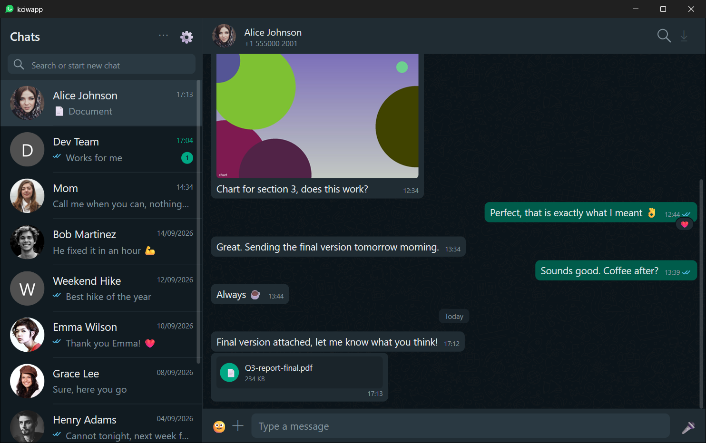
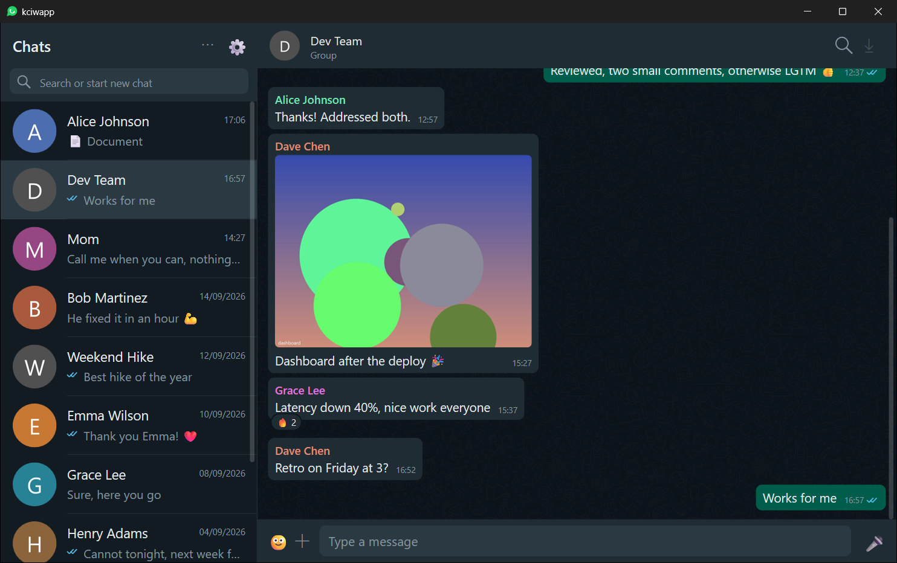
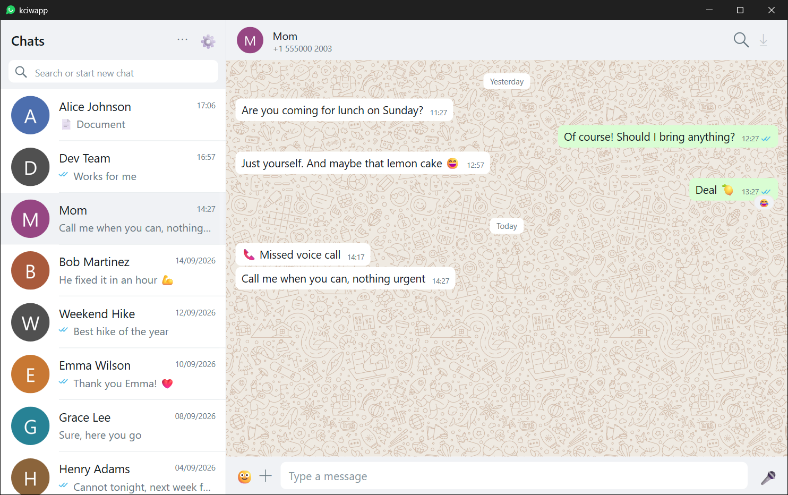
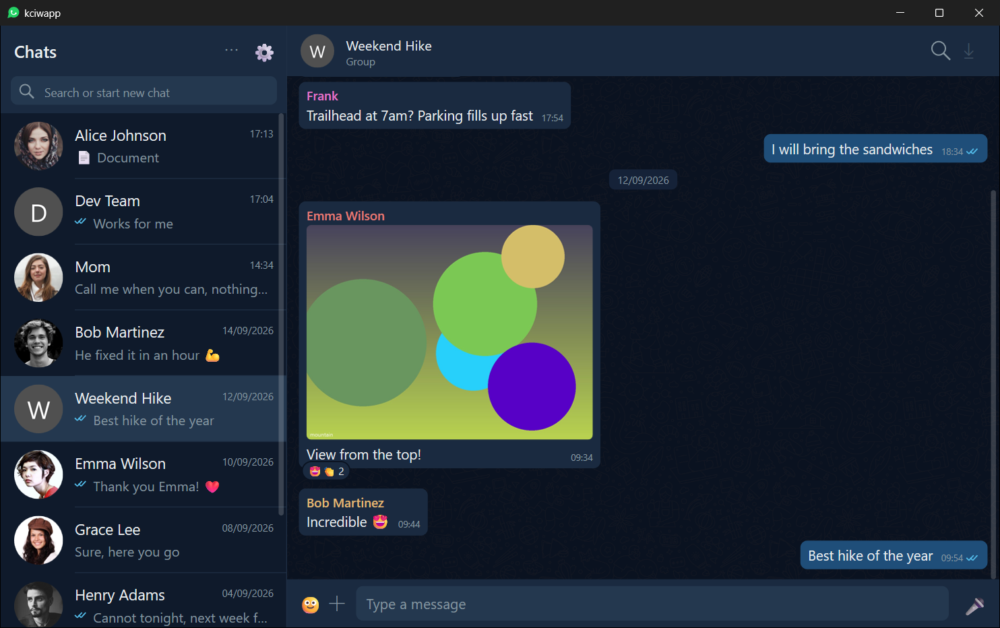

# kciwapp

  

<b>Windows 10/11 x64 &middot; free &middot; run it and it installs everything</b>

A native WhatsApp client for Windows: C++20, Win32 + Direct2D/DirectWrite, no
frameworks, every control drawn by hand. The WhatsApp side is a Go program
built on [whatsmeow](https://github.com/tulir/whatsmeow) that runs either
next to the client (`core\`, SQLite) or as a shared server on a Linux box
(MariaDB, several accounts).

**Unofficial.** It talks to WhatsApp through whatsmeow, which is against
WhatsApp's Terms of Service. Accounts using unofficial clients can get
suspended. Use it knowing that.

## Screenshots

Demo data, not real chats (see `docs/demo-datos.py`).

| Light theme | Blue theme |
| --- | --- |
|  |  |

## Install

Download and run
[kciwapp-setup.exe](https://github.com/kcinickgx/kciwapp/releases/download/current/kciwapp-setup.exe).
It asks where to install (default `C:\Program Files\KciWAPP`), downloads
everything from the `current` release (and the Whisper model from Hugging
Face), creates the shortcuts and opens kciwapp. Voice note transcription
(whisper.cpp with CUDA, 2.7 GB, needs an NVIDIA GPU) is a checkbox.

The client checks for updates when it opens and from the `⋯` menu; updates
download only the files whose MD5 changed.

Windows 10/11 x64. Calls use the Edge WebView2 runtime (bundled with Windows 11).

Server setup (Debian/Ubuntu or Slackware) is in [docs/INSTALL.md](docs/INSTALL.md) (Spanish).

## What it does

- Chats, groups, statuses, media (photos, albums, video with an mpv player,
  voice notes with waveform and speed, stickers, documents), reactions,
  replies, edits, forwards, search across chats and inside a chat.
- Own notifications, tray, themes, custom chat background, font sizes.
- Typing/recording presence both ways, read receipts, calls (voice and video,
  through a hidden WhatsApp Web in WebView2, with an own call window).
- Voice note transcription on demand (whisper.cpp large-v3-turbo).
- Message translation on demand with a local model (llama.cpp + Qwen2.5-7B).
- Several accounts per client; a shared server can host several people.
- Optional full history import from an iPhone backup (server side).

## Changelog

See [CHANGELOG.md](CHANGELOG.md). The version, build date and commit are in `⋯` → About.

## Build

Client: Visual Studio 2022+ (MSVC), CMake, Ninja. `build.cmd` builds
`build\kciwapp2.exe` and `build\kciwapp-setup.exe`.

Core/server: Go 1.22+. `core/build.sh windows` builds `kciwapp-core.exe`,
`core/build.sh server` a static Linux binary (both cross-compile with
`CGO_ENABLED=0`).

Code comments and identifiers are in Spanish; the UI is in English.

## License

GPL-2.0-or-later. See [LICENSE](LICENSE) and [THIRD-PARTY.md](THIRD-PARTY.md)
for the bundled components (whatsmeow MPL-2.0, mpv and ffmpeg GPL,
whisper.cpp MIT, CUDA runtime under NVIDIA's EULA).
